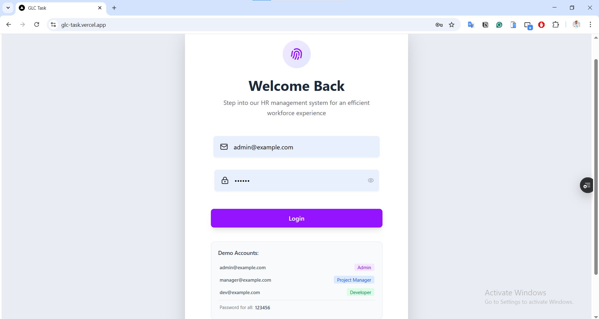
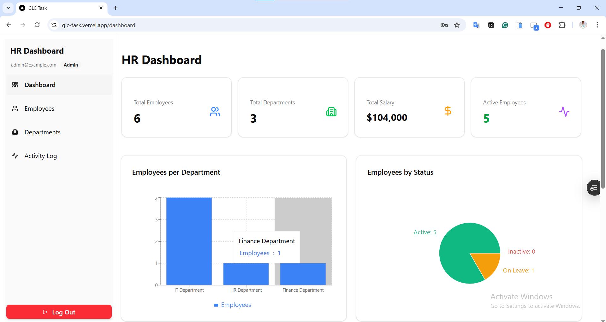
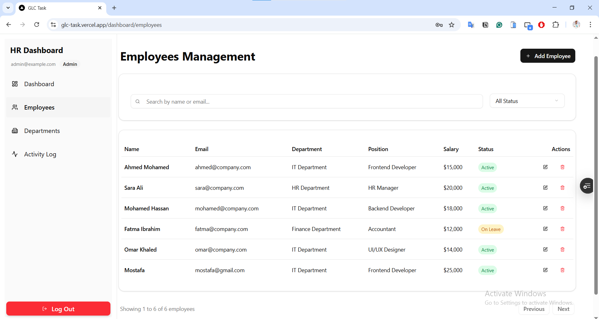
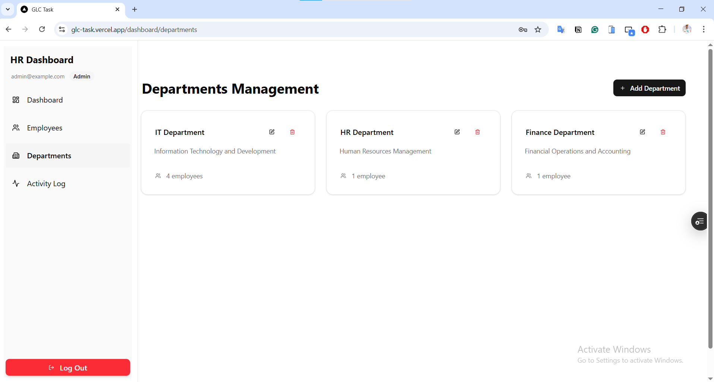
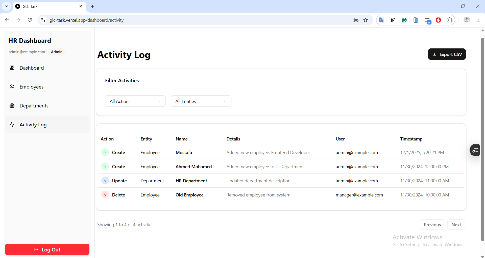

# GLC HR Dashboard

Live demo: [GLC HR Dashboard on Vercel](https://glc-task.vercel.app/)

## Screenshots

  

###

  

###

  

###

  

###

  


## Project Overview

This project is a fully functional **HR Dashboard** built with **React** and **Next.js**, without any backend.  
All data is handled locally using **JSON files, LocalStorage**, and **in-memory mock services**.  

The dashboard includes:

- **Local Authentication:** Users login with predefined credentials, protected routes based on role, and persisted auth state via Zustand and LocalStorage.  
- **Dashboard:** Displays total employees, total departments, total salary, charts of employees per department, and a recent activity log stored locally.  
- **Employees Management:** Full CRUD (Create, Read, Update, Delete) functionality with forms, validation, pagination, sorting, search with debounce, and soft delete with confirmation modals.  
- **Departments Management:** List, add, edit, delete departments, and show employee count per department.  
- **Activity Log:** Tracks all changes in employees and departments locally with pagination and filtering.  
- **Global Requirements:** Professional project structure, reusable components, custom hooks, responsive UI, and dark/light mode.  

### Bonus Features Implemented
- Project is fully **deployable on Vercel**.  
- Optional **CSV export** for activity logs implemented.  
- Local JSON/LocalStorage acts like a mock API for all data operations.  

## User Roles & Access

| Role | Capabilities |
|------|-------------|
| Admin | Full access to all features including employees and departments CRUD, activity logs, and dashboard charts |
| HR Manager | Can manage employees and departments, view dashboard and activity logs |
| Employee | Can view dashboard stats and activity logs only |

Predefined credentials for testing:

| Email | Password | Role |
|-------|----------|------|
| admin@example.com | 123456 | Admin |
| hrmanager@example.com | 123456 | HR Manager |
| employee@example.com | 123456 | Employee |

## Tech Stack

- **Next.js** for routing and rendering  
- **React** for UI  
- **TypeScript** for type safety  
- **TailwindCSS + ShadCN UI** for styling  
- **Zustand** for state management  
- **Recharts** for charts  
- **React Hook Form + Zod** for form validation  

## Getting Started

1. Install dependencies:

```bash
npm install
